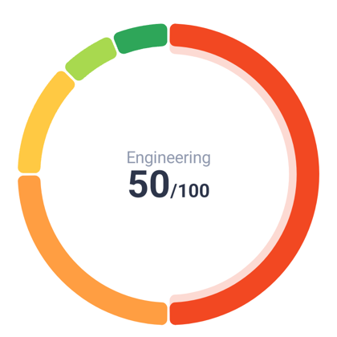
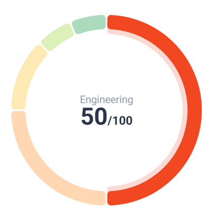
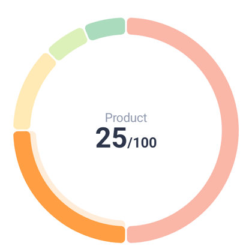
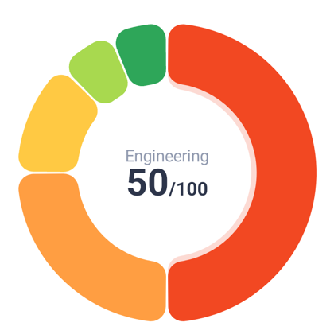
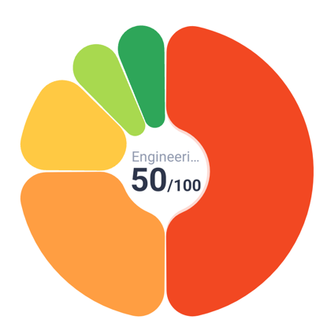
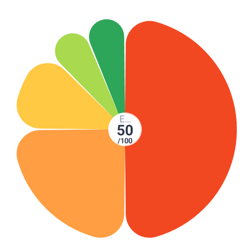
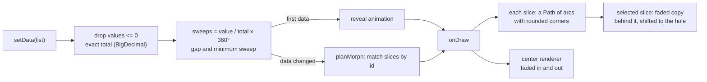
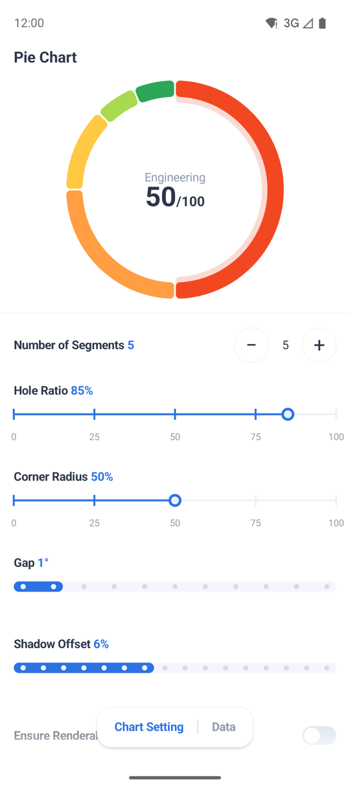
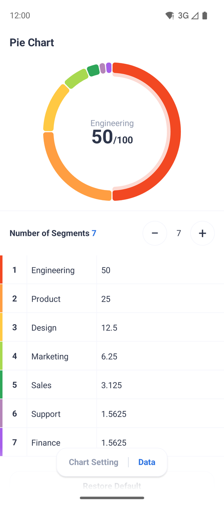

# PieChart

[](https://jitpack.io/#mohamadjavadx/PieChart)

An animated **pie / donut chart view** for Android (Kotlin, plain `View` — no Compose, no XML).
Tap a slice to select it: the slice gets a soft shadow and its details appear in the middle of the ring.

<p align="center">
  
  
  
</p>

## Features

- **Donut or pie**, with a configurable hole, gap between slices and corner rounding (outer and inner corners).
- **Exact values.** Slice values are `BigDecimal`, so totals and shares are not distorted by floating point;
  only the drawing angles are floats.
- **Animated.** The first data grows into place; later data changes *morph*: slices that stay resize,
  new ones grow in, removed ones shrink away where they were.
- **Tap selection** with a shadow behind the selected slice and optional dimming of the others.
  The selection follows its slice when the data changes.
- **Small slices grouped.** Slices too small to be seen can be merged into one "Other" slice; a tap on it opens them
  up on a ring of their own.
- **Details in the hole.** A pluggable renderer draws information about the selected slice in the middle.
  The default one shows a label, a value and a total, scales its text to the hole and hides itself when
  the hole is too small.
- **Always square,** and nothing to pull in beyond `androidx.annotation` and the Kotlin standard library.

## Install

The library is on [JitPack](https://jitpack.io/#mohamadjavadx/PieChart):

```kotlin
// settings.gradle.kts
dependencyResolutionManagement {
    repositories {
        google()
        mavenCentral()
        maven("https://jitpack.io")
    }
}

// build.gradle.kts of your app
dependencies {
    implementation("com.github.mohamadjavadx:PieChart:v1.0.0")
}
```

You can also download the `.aar` from the [Releases](https://github.com/mohamadjavadx/PieChart/releases) page, or add
the `:piechart` module to your project. Requires `minSdk 24`.

## Quick start

```kotlin
val chart = PieChartView(context)          // constructor takes only a Context
container.addView(chart, FrameLayout.LayoutParams(MATCH_PARENT, MATCH_PARENT))

chart.centerRenderer = DefaultCenterRenderer()   // show the selected slice in the hole

// Post the data once the view has a size, or the entry animation is skipped.
chart.post {
    chart.setData(
        listOf(
            PieChartData(id = 1, label = "Rent",      value = BigDecimal("1200"), color = 0xFFF24822.toInt()),
            PieChartData(id = 2, label = "Food",      value = BigDecimal("450"),  color = 0xFFFF9E42.toInt()),
            PieChartData(id = 3, label = "Transport", value = BigDecimal("150"),  color = 0xFFFFC943.toInt()),
        )
    )
}

chart.setOnSelectionChangedListener { slice ->     // SelectedSlice? — null when nothing is selected
    println(slice?.data?.label)
}
```

### Data

| `PieChartData` | |
|---|---|
| `id: Any` | Identity of the slice. Must be unique. Data changes are animated by matching ids, and the selection follows the id. |
| `label: String` | Shown by the default center renderer. |
| `value: BigDecimal` | Slices with a value of zero or less are ignored. |
| `color: Int` | ARGB color of the slice. |

`setData` can be called again at any time; `clearData()` shows an empty (gray) ring.

## Selection

- **Tap** a slice, or call `setSelectedIndex(index)` (`-1` clears it). If an animation is running, the request is
  applied when it ends.
- `currentSelection` gives the selected `SelectedSlice` (`index`, `data`, exact `total`, `fraction`). `index` is a place in
  `currentDataset`, which holds the merged slice while small slices are grouped.
- `setOnSelectionChangedListener` is called when the selection moves to another slice or to nothing.
  It is **not** called when new data keeps the same slice selected, even if the slice moved or its value changed.
- **The selection survives `setData`** as long as a slice with the same `id` is still in the data.
- While nothing is selected every slice is drawn normally. While one is selected, the others use
  `unselectedAlpha` (default 40%), and the selected one gets a **shadow**: the same slice, faded and shifted toward
  the hole, drawn behind it.

## Styling

Everything is set in one call so the chart redraws once:

```kotlin
chart.setStyle(
    holeRadiusRatio = 0.7f,             // 0..1 of the chart radius
    cornerRadiusRatio = 0.5f,           // 0..1 of half the ring thickness
    visualGapDeg = 2f,                  // angle between slices
    unselectedAlpha = 255,              // 255 = don't dim the others
    selectedShadowAlpha = 51,           // 0 turns the shadow off
    selectedShadowOffsetRatio = 0.06f,  // how far the shadow is shifted, as a share of the hole radius
)
```

| Option | Default | Meaning |
|---|---|---|
| `holeRadiusRatio` | `0.85` | Hole size as a share of the chart radius. |
| `cornerRadiusRatio` | `0.5` | Corner radius as a share of half the ring's thickness (then limited so it always fits). |
| `roundInnerCorners` | `true` | Round the corners on the hole side too (only for holes above 25%). |
| `visualGapDeg` | `1` | Gap between slices, in degrees. |
| `startAngleDeg` | `-90` | Where the first slice starts (`-90` is 12 o'clock). |
| `ensureRenderableSlices` | `true` | Give every slice at least the gap plus 1° so tiny ones stay visible. |
| `selectedAlpha` / `unselectedAlpha` | `255` / `102` | Alpha of the selected slice (and of all slices when none is selected) / of the others. |
| `selectedShadowAlpha` | `51` (20%) | Alpha of the shadow behind the selected slice. |
| `selectedShadowOffsetRatio` | `0.06` | Shadow shift as a share of the hole radius; never more than half the ring thickness. |
| `groupSmallSlices` | `false` | Merge the slices that are too small to see into one slice you can tap; see [Small slices](#small-slices). |
| `otherSliceColor` | gray | Color of the merged slice. |
| `mainSliceDim` | `0.7` | How much the big slices are dimmed while the small ones are expanded (0..1). |
| `disabledColor` | light gray | Color of the empty-state ring. |

**Sizes in dp.** The corner radius, the shadow offset and the gap can each be given in dp instead of as a ratio (in
degrees for the gap), independently of each other:

```kotlin
chart.setStyle(
    cornerRadiusDp = 6f,                // instead of cornerRadiusRatio
    selectedShadowOffsetRatio = 0.06f,  // this one stays a ratio
    visualGapDp = 2f,                   // instead of visualGapDeg
)
```

A setting that is not passed keeps the unit it has; passing both units of one setting is an error. A size in dp stays
that size when the chart is resized: the chart works out the ratio (or the angle) from it at its size, every time it is
laid out, and draws with that, and `cornerRadiusRatio`, `selectedShadowOffsetRatio` and `visualGapDeg` hold the result.
`cornerRadiusDp`, `selectedShadowOffsetDp` and `visualGapDp` are null while the setting is a ratio. The limits are those
of the ratios, and the gap in dp is measured along the chart's outer edge. The hole is a ratio only.

Animations: `setAnimationConfig(revealAnimationDuration, revealAnimationInterpolator, dataChangeAnimationDuration, dataChangeAnimationInterpolator)`
(defaults: 600 ms each). Padding works as on any view and the chart is drawn in the largest circle inside it.

> Note: `setStyle` and padding changes end any running animation and jump to the final layout.

## Small slices

A slice whose angle is under the gap plus 2° would have less than 2° left once the gap is cut out of it, so it
is hardly there, or not at all. With `groupSmallSlices` those slices are merged into one, and the chart stays tidy:

```kotlin
chart.setStyle(
    groupSmallSlices = true,
    otherSliceColor = 0xFF8A93A6.toInt(),   // the merged slice
    mainSliceDim = 0.7f,                    // how much the big slices are dimmed while the small ones are open
)
```

- **Overview.** The big slices are drawn as they are, and one slice, in `otherSliceColor`, stands for all the small
  ones. At least 10° of it is seen, whatever the gap (it is given the gap plus 10°), so that it can be seen and tapped; the
  big slices give up the difference.
- **Expanded.** A tap on that slice, or `chart.expandGroup()`, opens it and selects the first of the small slices: the
  big slices are squeezed into an arc 90° wide,
  drawn in their own colors, dimmed by `mainSliceDim`, side by side without gaps inside one rounded slice, and the small
  ones share the other 270°, in proportion to their values. Nothing changes color: the dimming is an opacity, so it suits
  any background. On the way, the big slices shrink into the arc, and back.
- **Back.** A tap on the arc of big slices, or `chart.collapseGroup()`, brings everything back and selects the first
  slice. The chart has no button for it, so a screen can offer one, and system Back, as well, that call
  `collapseGroup()`: `isGroupExpanded` tells when to, and `setOnGroupExpandedChangedListener { expanded -> ... }` tells
  when it changes. `setOnChunkClickListener` gets the slice that they select, like any other tap.
- Nothing is grouped unless at least two slices are small and at least one is not. When data changes and the group is
  gone, the chart collapses by itself and tells the listener.
- The slice the chart adds for the group has the id `OtherSliceId` (it is in `currentDataset`, so `setSelectedIndex` and
  `SelectedSlice.index` count it). It can not be selected, and neither can the big slices while they are in the arc:
  not by a tap, not by code, and the center of the ring never shows them. A selected big slice is deselected when the
  group expands, and expanding and collapsing select a slice again, as described above.
- A `SelectedSlice` in the overview or expanded view still has the total of *all* the data you gave, and the share of the
  slice in it, so a small slice shows the same numbers either way.
- The rule follows the gap: with a larger `visualGapDeg` more slices count as small. In the expanded ring the small
  slices are raised to the gap plus 1° by `ensureRenderableSlices` (on by default); with it off, those that would be
  smaller than the gap are not drawn.

## Details in the hole

Set a `CenterRenderer` and the chart draws it for the selected slice, fading it in and out.

```kotlin
chart.centerRenderer = DefaultCenterRenderer(
    style = CenterInfoStyle(labelColor = 0xFF8A93A6.toInt(), valueColor = 0xFF1F2633.toInt()),
    formatter = { slice ->                       // return null to draw nothing for a slice
        CenterInfo(
            label = slice.data.label,
            value = "${(slice.fraction * 100).roundToInt()}%",
        )
    },
)
```

`DefaultCenterRenderer` draws a label above a value with an optional suffix (by default the slice's value and `/total`):

<p align="center">
  
  
  
</p>

**How it adapts to the hole**

- Text sizes are real `sp` sizes (label 14, value 32, suffix 16) and follow the user's font scale.
- When the hole is smaller, the value and the suffix shrink together, but never below `minTextSizeSp` (11) for the value.
  The label follows the scale with the same floor and is shortened with an ellipsis.
- When the suffix would drop below `minInlineSuffixSizeSp` (8), it moves to its own line under the value.
- The text is sized for the selected slice alone, so a short value is not shrunk because another slice has a long one.
- **Whether the center is shown** is decided from *every* slice, each at its smallest size, so it never comes and goes
  as the selection moves. Control it with `chart.centerVisibility`:
  `WhenFits` (default), `Always`, `Never` or `MinHoleRatio(ratio)`.

**Your own content.** Implement `CenterRenderer`; the chart handles when to show it and the fading:

```kotlin
class DotRenderer : CenterRenderer {
    private val paint = Paint(Paint.ANTI_ALIAS_FLAG)

    // Called when the size, hole or data change; decide from geometry and all slices, not the selected one.
    override fun fits(area: CenterArea, slices: List<SelectedSlice>) = area.radius > 60f

    override fun draw(canvas: Canvas, area: CenterArea, slice: SelectedSlice, slices: List<SelectedSlice>) {
        paint.color = slice.data.color
        canvas.drawCircle(area.cx, area.cy, area.radius * 0.3f, paint)
    }
}
```

`CenterArea` gives the hole (`cx`, `cy`, `radius`, `safeRect`, and `widthFor(height)` for the width available to
a block of a given height). If you would rather use a normal `View` in the middle, read `chart.centerArea` and
`setOnSelectionChangedListener` and place it yourself.

## How it works



- **Angles.** A slice's sweep is `value / total × 360°`, computed from exact `BigDecimal`s. The gap between slices is
  taken out of each sweep. With `ensureRenderableSlices` (on by default), slices smaller than the gap plus 1° are raised to that minimum and
  the difference is taken proportionally from the larger ones.
- **Rounded corners.** Each corner is a circle tangent to the ring's edge and to the slice's side. Its radius is limited by
  the ring's thickness, by the angle available at that end of the slice, and by the space the outer and inner corner
  share, so any slice size or hole size gives a valid shape.
- **Morphing.** `planMorph` matches the old and new slices by `id`. Slices that stay interpolate from their old sweep to the
  new one, new slices grow from zero, and removed slices stay as "ghosts" that shrink to zero in place. Both layouts add up
  to 360°, so the ring is always complete, and the gap moves smoothly too. An interrupted animation continues from what is on
  screen.
- **Selection shadow.** The shadow is the slice's own shape drawn again on the same ring shifted toward the hole, at low alpha,
  *behind* the slice, so only the part that sticks out shows.
- **Hit testing.** A tap counts when it is within the ring (plus 8 dp) and its angle, measured from the start angle,
  falls in a slice that is actually drawn. Touches are ignored while an animation runs.
- **Center content.** A presenter fades the old content out and the new in when the slice changes (and updates in place when the
  same slice gets a new value). The default renderer works out one scale per slice from the width of the hole's chord at the
  height of its text block.

**Source layout**

| Path | What |
|---|---|
| `PieChartView.kt` | The view: state, animation, drawing, touch. |
| `geometry/SliceMath.kt` | Pure math: gap, sweeps, corner radii, hit test. |
| `geometry/Grouping.kt` | Pure logic: which slices are small, and what the overview and the expanded view show. |
| `geometry/Morph.kt` | Plans and describes one data-change animation. |
| `geometry/RingPathBuilder.kt` | Builds the outline of a slice on any ring. |
| `center/` | `CenterRenderer`, `DefaultCenterRenderer`, visibility rules and the fade presenter. |

## Demo app

The `:app` module is a settings playground for the chart: change the number of segments, hole size, corners, gap and
shadow, toggle dimming, and edit the data (label and value of every row, with Next moving between values). It groups
small slices too: tap the merged slice to open it, and go back with the chip above the chart, the main slice or system Back.

<p align="center">
  
  
</p>

## Limitations

- No XML attributes: create it in code (`PieChartView(context)`).
- No accessibility support yet: slices are not exposed to screen readers.
- No state saving: keep the data and the selected id in your own state (the demo does so in its view model).
- Main thread only. Touch is ignored while an animation is running.
- Right-to-left layouts are not mirrored.

## Contributing

Issues and pull requests are welcome. Run the demo (`./gradlew :app:installDebug`) and `./gradlew :piechart:lintRelease`
before sending a change.

## License

Copyright 2026 Mohamadjavad Pourmoradian.

Licensed under the [Apache License, Version 2.0](LICENSE). You may use, modify and distribute it, including in
commercial apps, as long as you keep the license and copyright notices; the license also grants you the right to use any
patents the code needs.
