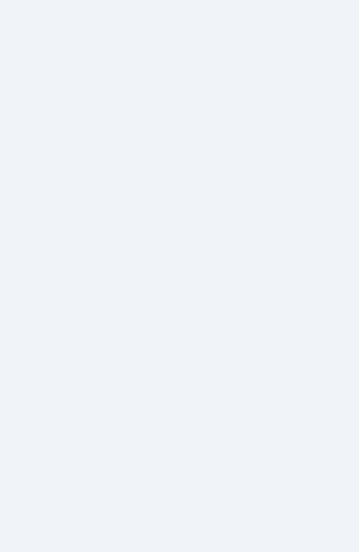
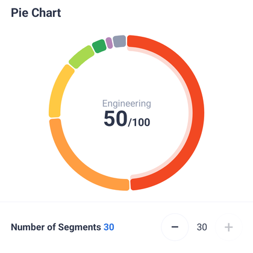
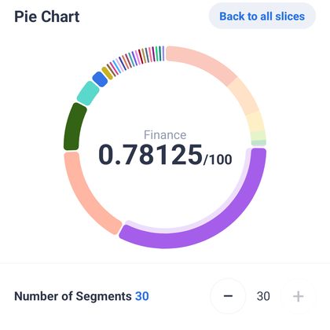
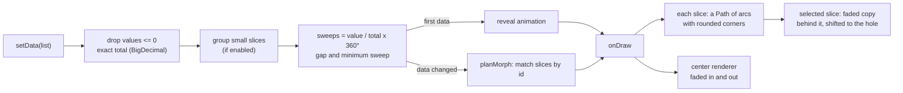

# PieChart

[](https://jitpack.io/#mohamadjavadx/PieChart)
[)](https://www.npmjs.com/package/@mohamadjavadx/piechart)

An animated **pie / donut chart** for Android, written as a plain Kotlin `View`: no Compose, no XML.

Tap a slice and it lifts off the ring with a soft shadow while its details appear in the middle. Data changes morph
smoothly, and slices that are too small to see fold into a single one that opens on tap.

**Also for the web:** the same chart in SVG, as a web component, a React component or a plain class.
**[Try the live demo](https://mohamadjavadx.github.io/PieChart/)** · [Web version](#web-version)

[Install](#install) · [Quick start](#quick-start) · [Selection](#selection) · [Styling](#styling) ·
[Small slices](#small-slices) · [Center content](#details-in-the-hole) · [Web version](#web-version) ·
[Changelog](CHANGELOG.md)

<p align="center">
  
</p>
<p align="center"><sub>The demo app. <a href="docs/demo.mp4">Watch it as a video</a> (sharper, and much smaller).</sub></p>

<p align="center">
  
  
  
</p>

## Features

- **Donut or pie.** The hole, the gap between slices and the corner rounding (outer and inner) are all adjustable, and
  the corners, the gap and the shadow offset can be given in dp.
- **Exact values.** Slice values are `BigDecimal`, so totals and shares are not distorted by floating point; only the
  drawing angles are floats.
- **Animated.** The first data grows into place; later changes *morph*: slices that stay resize, new ones grow in,
  removed ones shrink away where they were.
- **Tap selection.** The selected slice gets a shadow, the others can be dimmed, and the selection follows its slice
  when the data changes.
- **Small slices grouped.** Slices too small to see can be merged into one "Other" slice. Tap it to open them on a ring
  of their own, next to the big slices folded into one dimmed arc.
- **Details in the hole.** A pluggable renderer draws information about the selected slice in the middle. The default
  one shows a label, a value and a total, scales its text to fit the hole, and hides itself when the hole is too small.
- **Light.** Always square; the only dependencies are `androidx.annotation` and the Kotlin standard library.

## Install

The library is on [JitPack](https://jitpack.io/#mohamadjavadx/PieChart); the badge above shows the latest version.

```kotlin
// settings.gradle.kts
dependencyResolutionManagement {
    repositories {
        google()
        mavenCentral()
        maven("https://jitpack.io")
    }
}

// build.gradle.kts of your app
dependencies {
    implementation("com.github.mohamadjavadx:PieChart:v2.0.0")
}
```

You can also download the `.aar` from the [Releases](https://github.com/mohamadjavadx/PieChart/releases) page, or add
the `:piechart` module to your project. Requires `minSdk 24`.

**Coming from 1.0.0?** Version 2 changed the signature of `setStyle` and turned `ensureRenderableSlices` on by default.
See *Upgrading* in the [changelog](CHANGELOG.md).

## Quick start

```kotlin
val chart = PieChartView(context)          // the constructor takes only a Context
container.addView(chart, FrameLayout.LayoutParams(MATCH_PARENT, MATCH_PARENT))

chart.centerRenderer = DefaultCenterRenderer()   // show the selected slice in the hole

// Post the data once the view has been laid out: without a size the chart cannot draw,
// and the entry animation would play unseen.
chart.post {
    chart.setData(
        listOf(
            PieChartData(id = 1, label = "Rent",      value = BigDecimal("1200"), color = 0xFFF24822.toInt()),
            PieChartData(id = 2, label = "Food",      value = BigDecimal("450"),  color = 0xFFFF9E42.toInt()),
            PieChartData(id = 3, label = "Transport", value = BigDecimal("150"),  color = 0xFFFFC943.toInt()),
        )
    )
}

chart.setOnSelectionChangedListener { slice ->     // SelectedSlice? — null when nothing is selected
    println(slice?.data?.label)
}
```

### Data

| `PieChartData` | |
|---|---|
| `id: Any` | Identity of the slice. Must be unique. Data changes are animated by matching ids, and the selection follows the id. |
| `label: String` | Shown by the default center renderer. |
| `value: BigDecimal` | The size of the slice. Slices with a value of zero or less are ignored. |
| `color: Int` | ARGB color of the slice; a color that is not opaque draws partly transparent. |

Call `setData` again whenever the data changes and the chart morphs to it. `clearData()` shows an empty (gray) ring.

## Selection

- **Select** a slice by tapping it, or call `setSelectedIndex(index)` (`-1` clears it). While an animation runs, the
  request is applied when it ends.
- `currentSelection` is a `SelectedSlice`: its `index` (a place in `currentDataset`), its `data`, the exact `total` and
  the `fraction` (0..1, meant for drawing and rounding).
- `setOnSelectionChangedListener` is called when the selection moves to another slice or to nothing. It is **not**
  called when new data keeps the same slice selected, even if the slice moved or its value changed.
- `setOnChunkClickListener` is called with the slice that a tap selects, just before it is selected.
- **The selection survives `setData`** as long as a slice with the same `id` is still in the data.
- While nothing is selected every slice is drawn normally. While one is selected, the others are dimmed by
  `unselectedDim` (default 0.6), and the selected one gets a **shadow**: the same slice, faded and shifted toward the
  hole, drawn behind it.

## Styling

Everything is set in one call, so the chart redraws once:

```kotlin
chart.setStyle(
    holeRadiusRatio = 0.7f,             // 0..1 of the chart radius
    cornerRadiusRatio = 0.5f,           // 0..1 of half the ring thickness
    visualGapDeg = 2f,                  // angle between slices
    unselectedDim = 0f,                 // 0 = don't dim the others
    selectedShadowDim = 0.8f,           // 1 turns the shadow off
    selectedShadowOffsetRatio = 0.06f,  // how far the shadow is shifted, as a share of the hole radius
)
```

Every option is also readable as a property of the same name.

| Option | Default | Meaning |
|---|---|---|
| `holeRadiusRatio` | `0.85` | Hole size as a share of the chart radius. |
| `cornerRadiusRatio` | `0.5` | Corner radius as a share of half the ring's thickness (then limited so it always fits). |
| `roundInnerCorners` | `true` | Round the corners on the hole side too (only for holes above 25%). |
| `visualGapDeg` | `1` | Gap between slices, in degrees. |
| `startAngleDeg` | `-90` | Where the first slice starts (`-90` is 12 o'clock). |
| `ensureRenderableSlices` | `true` | Give every slice at least the gap plus 1° so tiny ones stay visible; the larger slices give up the difference. |
| `selectedDim` / `unselectedDim` | `0` / `0.6` | How much the selected slice (and every slice while none is selected) / the others are dimmed. |
| `selectedShadowDim` | `0.8` | How much the shadow behind the selected slice is faded; `1` turns it off. |
| `selectedShadowOffsetRatio` | `0.06` | Shadow shift as a share of the hole radius; never more than half the ring thickness. |
| `groupSmallSlices` | `false` | Merge the slices that are too small to see into one slice you can tap; see [Small slices](#small-slices). |
| `otherSliceColor` | gray | Color of the merged slice. |
| `mainSliceDim` | `0.6` | How much the big slices are dimmed while the small ones are expanded. |
| `disabledColor` | light gray | Color of the empty-state ring. |

**Dims.** Every option that ends in `Dim` is a fraction from 0, not dimmed, to 1, invisible: the slice is drawn at
`1 - dim` of its opacity, so it suits any background.

**Sizes in dp.** The corner radius, the shadow offset and the gap can each be given in dp instead of as a ratio (in
degrees for the gap), independently of each other:

```kotlin
chart.setStyle(
    cornerRadiusDp = 6f,                // instead of cornerRadiusRatio
    selectedShadowOffsetRatio = 0.06f,  // this one stays a ratio
    visualGapDp = 2f,                   // instead of visualGapDeg
)
```

A setting that is not passed keeps the unit it has, and passing both units of one setting is an error. A size in dp
stays that size when the chart is resized: the chart works out the ratio (or the angle) from it every time it is laid
out, and the ratio properties (`cornerRadiusRatio`, `selectedShadowOffsetRatio`, `visualGapDeg`) hold the result. The
`cornerRadiusDp`, `selectedShadowOffsetDp` and `visualGapDp` properties are null while the setting is a ratio. The
limits are those of the ratios, the gap in dp is measured along the chart's outer edge, and the hole is a ratio only.

**Animations.** `setAnimationConfig(revealAnimationDuration, revealAnimationInterpolator, dataChangeAnimationDuration,
dataChangeAnimationInterpolator)` sets the duration and interpolator of the reveal and of data changes (600 ms each by
default). **Padding** works as on any view: the chart is drawn in the largest circle inside it.

> Note: `setStyle` and padding changes end any running animation and jump to the final layout.

## Small slices

A slice whose angle is under the gap plus 2° would have less than 2° left once the gap is cut out of it, so it is
hardly there, or not at all. With `groupSmallSlices` those slices are merged into one, and the chart stays tidy:

```kotlin
chart.setStyle(
    groupSmallSlices = true,
    otherSliceColor = 0xFF8A93A6.toInt(),   // the merged slice
    mainSliceDim = 0.7f,                    // how much the big slices are dimmed while the small ones are open
)
```

<p align="center">
  
  
</p>

- **The rule.** A slice is small when its angle is under the gap plus 2°, so a larger gap makes more slices small.
  Nothing is grouped unless at least two slices are small and at least one is not.
- **Overview.** The big slices are drawn as they are, and one slice, in `otherSliceColor`, stands for all the small
  ones. It is given the gap plus 10°, so at least 10° of it is seen whatever the gap and it can be seen and tapped; the
  big slices give up the difference.
- **Expanded.** A tap on that slice, or `chart.expandGroup()`, opens it and selects the first of the small slices. The
  big slices are squeezed into an arc 90° wide, drawn in their own colors, dimmed by `mainSliceDim`, side by side
  inside one rounded slice, and the small slices share the other 270° in proportion to their values. The dimming is an
  opacity, so it suits any background. The change is animated: the big slices shrink into the arc, and back.
- **Going back.** A tap on the arc of big slices, or `chart.collapseGroup()`, brings everything back and selects the
  first slice. The chart draws no button for it, so a screen can offer its own, and handle system Back: call
  `collapseGroup()`, use `isGroupExpanded` to know when to, and `setOnGroupExpandedChangedListener { expanded -> ... }`
  to hear about every change.
- **Selection.** The slice the chart adds has the id `OtherSliceId` and is part of `currentDataset`, so
  `setSelectedIndex` and `SelectedSlice.index` count it. It can not be selected, and neither can the big slices while
  they are in the arc, by a tap or by code, and the center of the ring never shows them. A selected big slice is
  deselected when the group opens, and `setOnChunkClickListener` gets the slice that opening or closing selects.
- **The numbers stay true.** A `SelectedSlice` in either view has the total of *all* the data you gave, and the real
  share of the slice in it, so a small slice shows the same numbers whether the group is open or not.
- **When the group goes away** (new data, a gap that leaves no small slices, or `groupSmallSlices = false`) the chart
  collapses by itself and tells the listener. In the expanded ring the small slices are raised to the gap plus 1° by
  `ensureRenderableSlices` (on by default); with it off, those that would be smaller than the gap are not drawn.

## Details in the hole

Set a `CenterRenderer` and the chart draws it for the selected slice, fading it in and out.

```kotlin
chart.centerRenderer = DefaultCenterRenderer(
    style = CenterInfoStyle(labelColor = 0xFF8A93A6.toInt(), valueColor = 0xFF1F2633.toInt()),
    formatter = { slice ->                       // return null to draw nothing for a slice
        CenterInfo(
            label = slice.data.label,
            value = "${(slice.fraction * 100).roundToInt()}%",
        )
    },
)
```

`DefaultCenterRenderer` draws a label above a value with an optional suffix (by default the slice's value and `/total`):

<p align="center">
  
  
  
</p>

**How it adapts to the hole**

- Text sizes are real `sp` sizes (label 14, value 32, suffix 16) and follow the user's font scale.
- In a smaller hole the value and the suffix shrink together, but never below `minTextSizeSp` (11) for the value. The
  label follows the scale with the same floor and is shortened with an ellipsis.
- When the suffix would drop below `minInlineSuffixSizeSp` (8), it moves to its own line under the value.
- The text is sized for the selected slice alone, so a short value is not shrunk because another slice has a long one.
- **Whether the center is shown** is decided from *every* slice, each at its smallest size, so it never comes and goes
  as the selection moves. Control it with `chart.centerVisibility`: `WhenFits` (default), `Always`, `Never` or
  `MinHoleRatio(ratio)`.

**Your own content.** Implement `CenterRenderer`; the chart handles when to show it and the fading:

```kotlin
class DotRenderer : CenterRenderer {
    private val paint = Paint(Paint.ANTI_ALIAS_FLAG)

    // Called when the size, hole or data change; decide from geometry and all slices, not the selected one.
    override fun fits(area: CenterArea, slices: List<SelectedSlice>) = area.radius > 60f

    override fun draw(canvas: Canvas, area: CenterArea, slice: SelectedSlice, slices: List<SelectedSlice>) {
        paint.color = slice.data.color
        canvas.drawCircle(area.cx, area.cy, area.radius * 0.3f, paint)
    }
}
```

`CenterArea` gives the hole (`cx`, `cy`, `radius`, `safeRect`, and `widthFor(height)` for the width available to a
block of a given height). If you would rather use a normal `View` in the middle, read `chart.centerArea` and
`setOnSelectionChangedListener` and place it yourself.

## How it works



- **Angles.** A slice's sweep is `value / total × 360°`, computed from exact `BigDecimal`s. The gap between slices is
  taken out of each sweep. With `ensureRenderableSlices` (on by default), slices smaller than the gap plus 1° are
  raised to that minimum and the difference is taken proportionally from the larger ones.
- **Grouping.** The chart keeps what you gave it and shows a list derived from it, which it then draws and animates
  like any other data. With grouping on, that list is the big slices followed by `OtherSliceId`, or, when expanded, the
  big slices followed by the small ones. The big slices of an expanded group are a *band*: they share exactly 90°, are
  drawn as flush sectors in an offscreen layer, dimmed, and cut to the outline of one rounded slice. They fade between
  that and ordinary slices while the change is animated.
- **Rounded corners.** Each corner is a circle tangent to the ring's edge and to the slice's side. Its radius is
  limited by the ring's thickness, by the angle available at that end of the slice, and by the space the outer and
  inner corner share, so any slice size or hole size gives a valid shape.
- **Morphing.** `planMorph` matches the old and new slices by `id`. Slices that stay interpolate from their old sweep
  to the new one, new slices grow from zero, and removed slices stay as "ghosts" that shrink to zero in place. Both
  layouts add up to 360°, so the ring is always complete, and the gap moves smoothly too. An interrupted animation
  continues from what is on screen.
- **Selection shadow.** The shadow is the slice's own shape drawn again on the same ring shifted toward the hole, at low
  alpha, *behind* the slice, so only the part that sticks out shows.
- **Hit testing.** A tap counts when it is within the ring (plus 8 dp) and its angle, measured from the start angle,
  falls in a slice that is actually drawn. Touches are ignored while an animation runs.
- **Center content.** A presenter fades the old content out and the new in when the slice changes (and updates in place
  when the same slice gets a new value). The default renderer works out one scale per slice from the width of the
  hole's chord at the height of its text block.

**Source layout**

| Path | What |
|---|---|
| `PieChartView.kt` | The view: state, animation, drawing, touch. |
| `geometry/SliceMath.kt` | Pure math: gap, sweeps, corner radii, hit test. |
| `geometry/Grouping.kt` | Pure logic: which slices are small, and what the overview and the expanded view show. |
| `geometry/Morph.kt` | Plans and describes one data-change animation. |
| `geometry/RingPathBuilder.kt` | Builds the outline of a slice on any ring. |
| `center/` | `CenterRenderer`, `DefaultCenterRenderer`, visibility rules and the fade presenter. |

## Demo app

The `:app` module is a playground for the chart. Change the number of segments (hold + or − to run through them), the
hole size, the corners, the gap and the shadow (each in dp or relative, with a toggle), switch the grouping of small
slices and the dimming of the others, and edit the data: the label and value of every row, with Next moving between
values. Add rows up to 30 to see small slices group: tap the merged slice to open it, and go back with the chip above
the chart, a tap on the dimmed arc, or system Back.

<p align="center">
  
  
</p>

## Web version

The same look and the same features, for web pages: drawn with SVG, with no dependencies, animated, and accessible to
screen readers and the keyboard. It comes as a `<pie-chart>` web component, a React component and a plain class, and
is checked against this library's own code and pixels.

```
npm install @mohamadjavadx/piechart
```

- **[Live demo](https://mohamadjavadx.github.io/PieChart/)**: a chart to tap, the settings playground of the demo app
  above, and the web component and React demos.
- [Documentation](https://github.com/mohamadjavadx/PieChart/tree/web/web#readme), with the options, the accessibility
  and the performance numbers, and the package on [npm](https://www.npmjs.com/package/@mohamadjavadx/piechart).

## Limitations

- No XML attributes: create it in code (`PieChartView(context)`).
- No accessibility support yet: slices are not exposed to screen readers.
- No state saving: keep the data and the selected id in your own state (the demo keeps them in its view model). If you
  group small slices, also keep whether the group is open: to restore it, call `expandGroup()`, then `setSelectedIndex`.
- Main thread only. Touch is ignored while an animation is running.
- Right-to-left layouts are not mirrored.

## Contributing

Issues and pull requests are welcome. Run the demo (`./gradlew :app:installDebug`) and `./gradlew :piechart:lintRelease`
before sending a change, and note anything users will see in [CHANGELOG.md](CHANGELOG.md). Releasing is described in
[docs/RELEASING.md](docs/RELEASING.md).

## License

Copyright 2026 Mohamadjavad Pourmoradian.

Licensed under the [Apache License, Version 2.0](LICENSE). You may use, modify and distribute it, including in
commercial apps, as long as you keep the license and copyright notices; the license also grants you the right to use any
patents the code needs.
